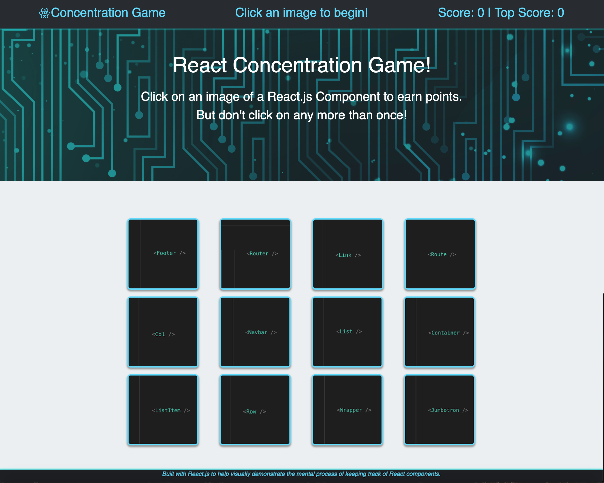

#  React Concentration Game

## *Practice Keeping Track of React Components*

### The following project is a game built with React.js to help visually demonstrate the mental process of keeping track of React components.

I employed HTML, CSS, JavaScript, Yarn, and React.js to make this application. All of the task-specific React components are rendered when the page loads and when the Class 'state' changes, while the Class 'state' tracks the 'cards' of the concentration game, the score, the top score acheived, and the messages displayed at the top of the pages.

### Game Play:

* Visit the link to the deployed application at the bottom of this README, or at the top of the GitHub page

* Click on any 'card' to start the game
    * Unlike a standard game of Concentration, the 'cards' are all face up and represent possible React components a developer might build
    * Once you click on a 'card', the game begins; your score and the top score are updated automatically, and you are alerted whether you've made a 'correct' choice
    * Every time a 'card' is clicked, the cards will shuffle their location on the page, so you will have to remember which ones you've already clicked
    * Try not to click the same 'card' twice! If you do, you will be alerted of an incorrect choice, and the game will restart, but your top score will remain. If you make it all the way to the end without clicking any of the cards twice, you win! You're well on your way to being ready to develop your own React application!

## 

 React's Component-based, functional programming allows web developers to minimize the amount of work each file does, making the application more efficient, easily editable, and making live updates possible. In this application, I utilized ECMA6 classes to define components that render specific snippets of HTML, CSS, and JavaScript. The App component responsible for rendering all of the sub-components also handles the logic of the game, using the object 'state' to track data and pass props to the corresponding sub-components:

 ``` javascript
class App extends Component {
    state = {
        cards,
        score: 0,
        topScore: 0,
        message: "Click an image to begin!"
    };
    componentDidMount() {
        this.setState({ cards: this.shuffleDeck(this.state.cards) });
    }
    handleCardClick = id => {
        let choseCorrectly = false;
        const updatedDeck = this.state.cards.map(card => {
            if (card.id === id) {
                if (!card.clicked) {
                    card.clicked = true;
                    choseCorrectly = true;
                }
            }
            return card;
        });
        choseCorrectly ? this.handleCorrectChoice(updatedDeck) : this.handleIncorrectChoice(updatedDeck);
    };
}
export default App;
 ```
### Feel free to play around with the application and train your brain to keep track of React components!

[Link to my Game](https://jacksonsabol.github.io/React-Concentration-Game/)

Thank you for reading!

### Built With:
* HTML
* CSS
* JavaScript
* React.js
* Yarn
* JSON
* Bootstrap CSS Library
* GitHub